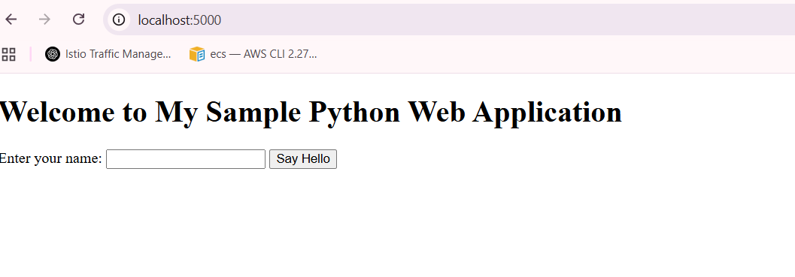

# docker-basics
Repository for the Assignments of docker basics

# Set up the application
We have a sample Python flask application which contains the index.html along with the Dockerfile.

To run the application we need to build the image using Dockerfile and run the application.

1. Navigate to the application directory

```
docker build -t <app_name> .
```
2. Once the image building process completed, need to run the container using the image we build.

```
docker run -it --name <app_name> -p 5000:5000 <image_name>:<tag>
```
3. Once container starts running, let's hit the "http://127.0.0.1:5000" to run the application, it should be looks like below: 



